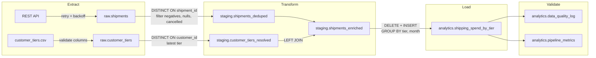

# Shipment Analytics Pipeline

A production-hardened ETL pipeline that ingests shipment data from a REST API and customer tier information from a CSV file, then produces monthly shipping spend analytics grouped by customer tier.

Built with Apache Airflow, PostgreSQL, and Docker.

## Architecture



See `docs/architecture.mermaid` and `docs/data-flow.mermaid` for additional diagrams.

## Prerequisites

- Docker Desktop (running)
- Docker Compose
- 4 GB available RAM

## Quick Start

Start all services:

```bash
docker-compose up -d
```

Wait 2-3 minutes for initialization, then access:

| Service         | URL                          |
|-----------------|------------------------------|
| Airflow UI      | http://localhost:8080         |
| Shipment API    | http://localhost:8000         |
| PostgreSQL      | localhost:5432                |

Airflow credentials: `admin` / `admin`

Run the pipeline:

1. Open the Airflow UI
2. Find the DAG `shipment_analytics_pipeline`
3. Enable it with the toggle
4. Trigger a manual run with the play button

Verify results:

```bash
docker-compose exec postgres psql -U airflow -d airflow \
  -c "SELECT * FROM analytics.shipping_spend_by_tier ORDER BY year_month, tier;"
```

Stop services:

```bash
docker-compose down
```

Reset all data:

```bash
docker-compose down -v
```

## Project Structure

```
.
├── dags/
│   └── shipment_analytics_dag.py
├── scripts/
│   ├── db.py
│   ├── metrics.py
│   ├── extract_shipments.py
│   ├── extract_customer_tiers.py
│   ├── transform_data.py
│   ├── load_analytics.py
│   └── validate_data.py
├── sql/
│   └── init.sql
├── data/
│   └── customer_tiers.csv
├── api/
│   ├── app.py
│   ├── Dockerfile
│   └── requirements.txt
├── tests/
│   ├── test_sample.py
│   └── requirements.txt
├── docs/
│   ├── architecture.mermaid
│   └── data-flow.mermaid
├── docker-compose.yml
├── Dockerfile
├── ENGINEERING_AUDIT.md
├── DESIGN_REFLECTION.md
└── README.md
```

## Data Pipeline

The pipeline runs as a single Airflow DAG with five tasks:

**extract_shipments** - Fetches shipment records from the REST API with retry logic and exponential backoff. Loads raw data into `raw.shipments`.

**extract_customer_tiers** - Reads the customer tiers CSV with column validation. Loads into `raw.customer_tiers`.

**transform_data** - Deduplicates shipments by ID (keeping the most recent), resolves customer tier changes (latest tier per customer), filters out records with negative costs, null customer IDs, and cancelled statuses. Joins shipments with tiers and writes enriched data to `staging.shipments_enriched`.

**load_analytics** - Aggregates enriched data by tier and month. Uses DELETE + INSERT within a single transaction for idempotency. The pipeline produces identical results regardless of how many times it runs.

**validate_data_quality** - Runs nine automated data quality checks after each pipeline run. Results are logged to `analytics.data_quality_log` for auditability. Checks include row count consistency between layers, absence of duplicates, no negative spend, and sum reconciliation between staging and analytics.

## Observability

Every pipeline stage records execution metrics to `analytics.pipeline_metrics`:

| Column | Description |
|--------|-------------|
| `stage` | Pipeline step name |
| `rows_processed` | Number of rows successfully processed |
| `rows_rejected` | Number of rows filtered or rejected |
| `duration_seconds` | Wall-clock time for the stage |
| `status` | success or failure |

Data quality checks are logged to `analytics.data_quality_log` with pass/fail results and details.

Query recent pipeline health:

```sql
SELECT stage, rows_processed, rows_rejected, duration_seconds, status
FROM analytics.pipeline_metrics
ORDER BY run_timestamp DESC
LIMIT 20;

SELECT check_name, check_result, details
FROM analytics.data_quality_log
ORDER BY run_timestamp DESC
LIMIT 20;
```

## Configuration

Database credentials and service URLs are configured via environment variables with defaults for local development:

| Variable              | Default     |
|-----------------------|-------------|
| `POSTGRES_USER`       | airflow     |
| `POSTGRES_PASSWORD`   | airflow     |
| `POSTGRES_DB`         | airflow     |
| `PIPELINE_DB_HOST`    | postgres    |
| `PIPELINE_DB_PORT`    | 5432        |
| `SHIPMENT_API_URL`    | http://api:8000 |

Override via a `.env` file in the project root for non-default deployments.

## Running Tests

Tests run inside the Airflow container against a live database:

```bash
docker-compose exec airflow-webserver pytest /opt/airflow/tests/ -v
```

The test suite validates:

- Extraction populates raw tables
- Extraction is idempotent (same count after re-run)
- Deduplication removes duplicate shipment IDs
- Negative costs are filtered
- Cancelled shipments are excluded
- Null customer IDs are excluded
- Tier resolution picks the latest tier
- Analytics aggregation is idempotent (identical results on re-run)
- All spend values are positive
- Year-month format is consistent

## Useful Commands

View logs:

```bash
docker-compose logs airflow-scheduler -f
docker-compose logs api -f
docker-compose logs postgres -f
```

Connect to database:

```bash
docker-compose exec postgres psql -U airflow -d airflow
```

Check API:

```bash
curl http://localhost:8000/api/shipments | jq
```

## Technical Stack

- Apache Airflow 2.7.3
- PostgreSQL 13
- Python 3.9
- Docker and Docker Compose
