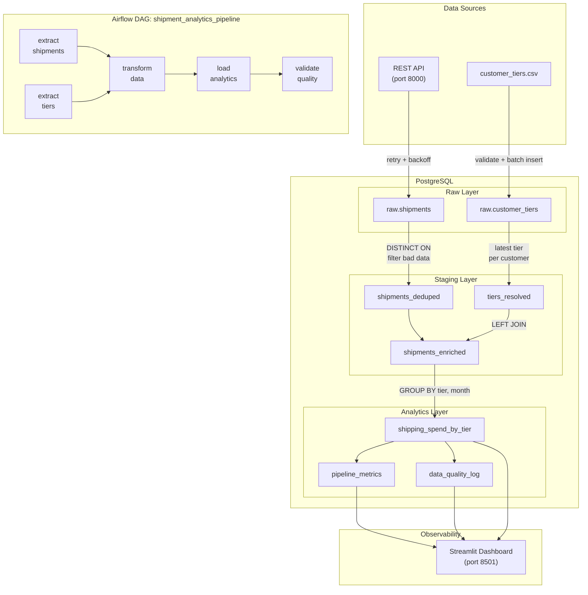
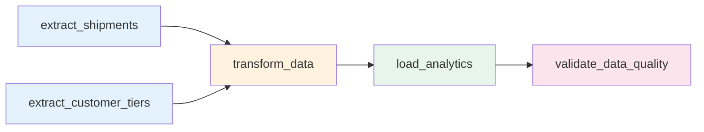
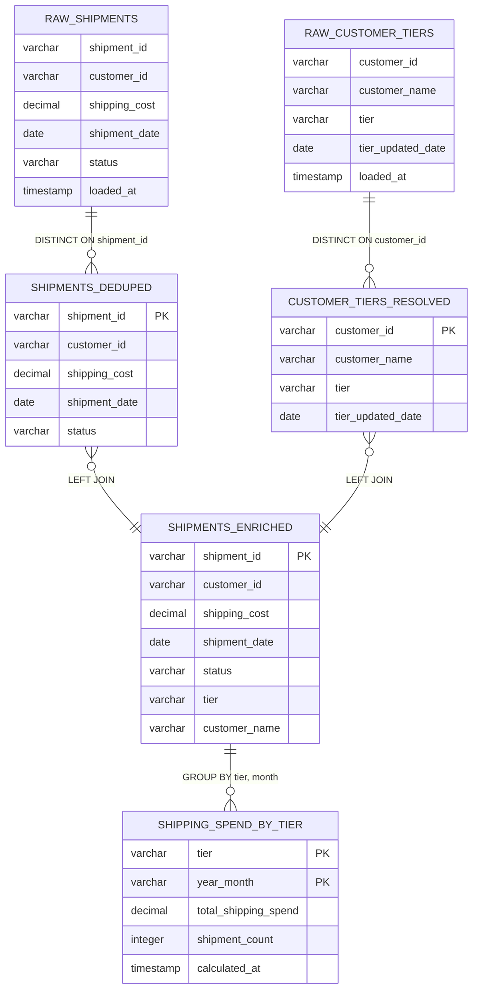

# Shipment Analytics Pipeline


A production-hardened ETL pipeline that ingests shipment data from a REST API and customer tier information from a CSV file, then produces monthly shipping spend analytics grouped by customer tier. Includes a real-time observability dashboard, automated data quality gates, and pipeline execution metrics.

---

## Architecture



---

## Quick Start

```bash
docker-compose up -d --build
```

Wait 2-3 minutes for initialization, then access:

| Service | URL | Credentials |
|---------|-----|-------------|
| Airflow UI | [http://localhost:8080](http://localhost:8080) | `admin` / `admin` |
| Dashboard | [http://localhost:8501](http://localhost:8501) | -- |
| Shipment API | [http://localhost:8000](http://localhost:8000) | -- |
| PostgreSQL | `localhost:5432` | `airflow` / `airflow` |

**Run the pipeline:**

1. Open the Airflow UI at [http://localhost:8080](http://localhost:8080)
2. Find `shipment_analytics_pipeline`, enable the toggle
3. Click the play button to trigger a run
4. Open the [Dashboard](http://localhost:8501) to see results

**Verify via CLI:**

```bash
docker-compose exec postgres psql -U airflow -d airflow \
  -c "SELECT * FROM analytics.shipping_spend_by_tier ORDER BY year_month, tier;"
```

**Stop / Reset:**

```bash
docker-compose down        # stop services
docker-compose down -v     # stop + delete all data
```

---

## Observability Dashboard

The pipeline includes a Streamlit dashboard at [http://localhost:8501](http://localhost:8501) that provides real-time visibility into pipeline health:

| Tab | What it shows |
|-----|---------------|
| **Analytics Output** | Spend by tier visualization, totals, detailed breakdown |
| **Data Quality** | Latest check results (pass/fail), check history |
| **Pipeline Metrics** | Per-stage row counts, rejected rows, duration, status |
| **Data Lineage** | Row counts through each layer, processing funnel |

---

## Data Pipeline

The DAG has five tasks that execute in sequence:



| Task | Description |
|------|-------------|
| **extract_shipments** | Fetches from REST API with retry + exponential backoff. Batch inserts into `raw.shipments`. |
| **extract_customer_tiers** | Validates CSV columns, filters nulls, batch inserts into `raw.customer_tiers`. |
| **transform_data** | Deduplicates by shipment ID, resolves tier changes (latest wins), filters negative costs / nulls / cancelled. Joins into `staging.shipments_enriched`. |
| **load_analytics** | DELETE + INSERT in a single transaction for idempotency. Groups by tier and month. |
| **validate_data_quality** | Runs 9 automated checks. Fails the DAG if any check fails. Logs results to `analytics.data_quality_log`. |

---

## Data Model



---

## Observability Tables

<details>
<summary><b>analytics.pipeline_metrics</b> - Execution telemetry per stage</summary>

| Column | Type | Description |
|--------|------|-------------|
| `run_id` | `VARCHAR(100) PK` | Unique identifier per stage execution |
| `run_timestamp` | `TIMESTAMP` | When the stage ran |
| `stage` | `VARCHAR(50)` | Pipeline step name |
| `rows_processed` | `INTEGER` | Rows successfully processed |
| `rows_rejected` | `INTEGER` | Rows filtered or rejected |
| `duration_seconds` | `DECIMAL(10,3)` | Wall-clock time |
| `status` | `VARCHAR(20)` | `success` or `failure` |

</details>

<details>
<summary><b>analytics.data_quality_log</b> - Automated check results</summary>

| Column | Type | Description |
|--------|------|-------------|
| `check_id` | `SERIAL PK` | Auto-increment ID |
| `run_timestamp` | `TIMESTAMP` | When the check ran |
| `check_name` | `VARCHAR(100)` | Name of the quality check |
| `check_result` | `VARCHAR(20)` | `pass` or `fail` |
| `details` | `TEXT` | Human-readable description |

**Checks performed:** `raw_not_empty`, `deduped_less_than_raw`, `enriched_matches_deduped`, `analytics_not_empty`, `no_negative_costs_in_staging`, `no_duplicate_shipment_ids`, `no_null_tiers_in_enriched`, `no_non_positive_spend_in_analytics`, `analytics_total_matches_enriched`

</details>

---

## Testing

21 integration tests across 5 test classes:

```bash
docker-compose exec airflow-webserver pytest /opt/airflow/tests/ -v
```

<details>
<summary><b>Test Coverage</b></summary>

| Class | Tests | What it validates |
|-------|-------|-------------------|
| `TestExtractShipments` | 3 | Raw table populated, idempotent, all fields preserved |
| `TestExtractCustomerTiers` | 2 | Raw tiers populated, idempotent |
| `TestTransform` | 7 | Deduplication, negative cost filtering, cancelled exclusion, null ID exclusion, tier resolution (latest wins), unknown customer handling, no null tiers |
| `TestLoadAnalytics` | 6 | Analytics populated, idempotent (run twice = same result), no negative spend, all positive, counts positive, YYYY-MM format |
| `TestValidateData` | 3 | All 9 quality checks pass, quality log populated, pipeline metrics recorded |

</details>

---

## Configuration

<details>
<summary><b>Environment Variables</b></summary>

| Variable | Default | Description |
|----------|---------|-------------|
| `POSTGRES_USER` | `airflow` | Database user |
| `POSTGRES_PASSWORD` | `airflow` | Database password |
| `POSTGRES_DB` | `airflow` | Database name |
| `PIPELINE_DB_HOST` | `postgres` | Pipeline DB host |
| `PIPELINE_DB_PORT` | `5432` | Pipeline DB port |
| `SHIPMENT_API_URL` | `http://api:8000` | Shipment API base URL |
| `CUSTOMER_TIERS_CSV` | `/opt/airflow/data/customer_tiers.csv` | Path to tiers CSV |

Override via a `.env` file in the project root. See `.env.example`.

</details>

---

## Project Structure

```
.
├── dags/
│   └── shipment_analytics_dag.py       # Airflow DAG definition (5 tasks)
├── scripts/
│   ├── db.py                           # Connection management (env-based, context managers)
│   ├── metrics.py                      # Pipeline metrics + quality check recording
│   ├── extract_shipments.py            # API extraction with retry + batch insert
│   ├── extract_customer_tiers.py       # CSV extraction with validation + batch insert
│   ├── transform_data.py              # Deduplication, tier resolution, enrichment
│   ├── load_analytics.py              # Idempotent analytics aggregation
│   └── validate_data.py               # 9 automated data quality checks
├── sql/
│   └── init.sql                        # Schema + table definitions with constraints
├── dashboard/
│   ├── app.py                          # Streamlit observability dashboard
│   ├── Dockerfile
│   └── requirements.txt
├── data/
│   └── customer_tiers.csv
├── api/
│   ├── app.py                          # Mock shipment API
│   ├── Dockerfile
│   └── requirements.txt
├── tests/
│   ├── test_sample.py                  # 21 integration tests
│   └── requirements.txt
├── docs/
│   ├── architecture.mermaid
│   └── data-flow.mermaid
├── docker-compose.yml
├── Dockerfile
├── .env.example
├── ENGINEERING_AUDIT.md                # 24 issues documented
├── DESIGN_REFLECTION.md                # Trade-offs, deep dives, scalability
└── README.md
```

---

## Technical Stack

| Component | Technology | Purpose |
|-----------|------------|---------|
| Orchestration | Apache Airflow 2.7.3 | DAG scheduling, task management, retry logic |
| Database | PostgreSQL 13 | Raw/staging/analytics data storage |
| Pipeline | Python 3.9 | ETL scripts, data validation |
| Observability | Streamlit | Real-time pipeline dashboard |
| Infrastructure | Docker Compose | Service orchestration |
